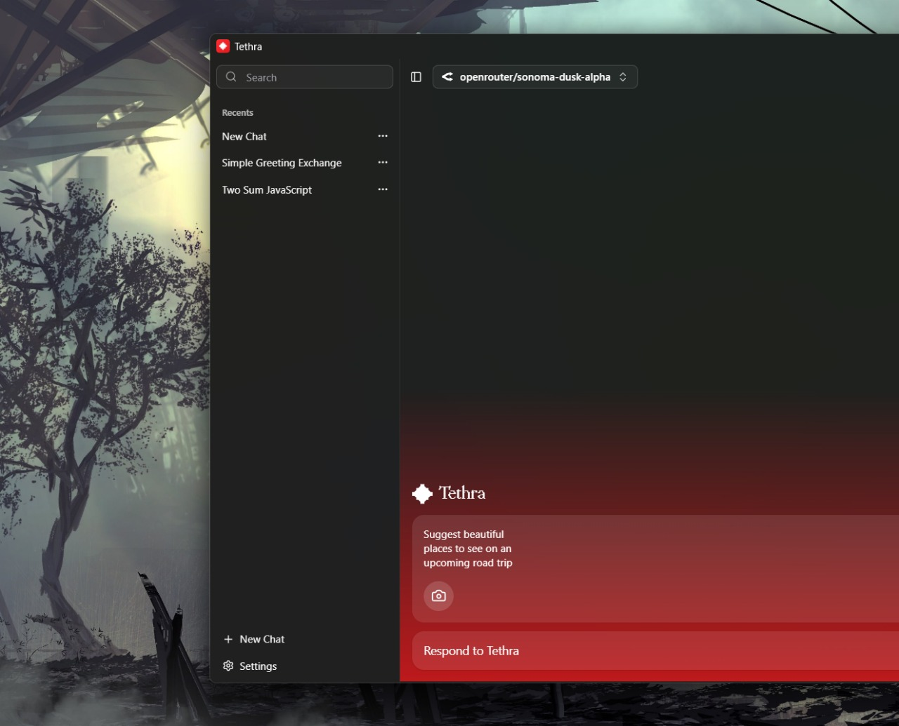
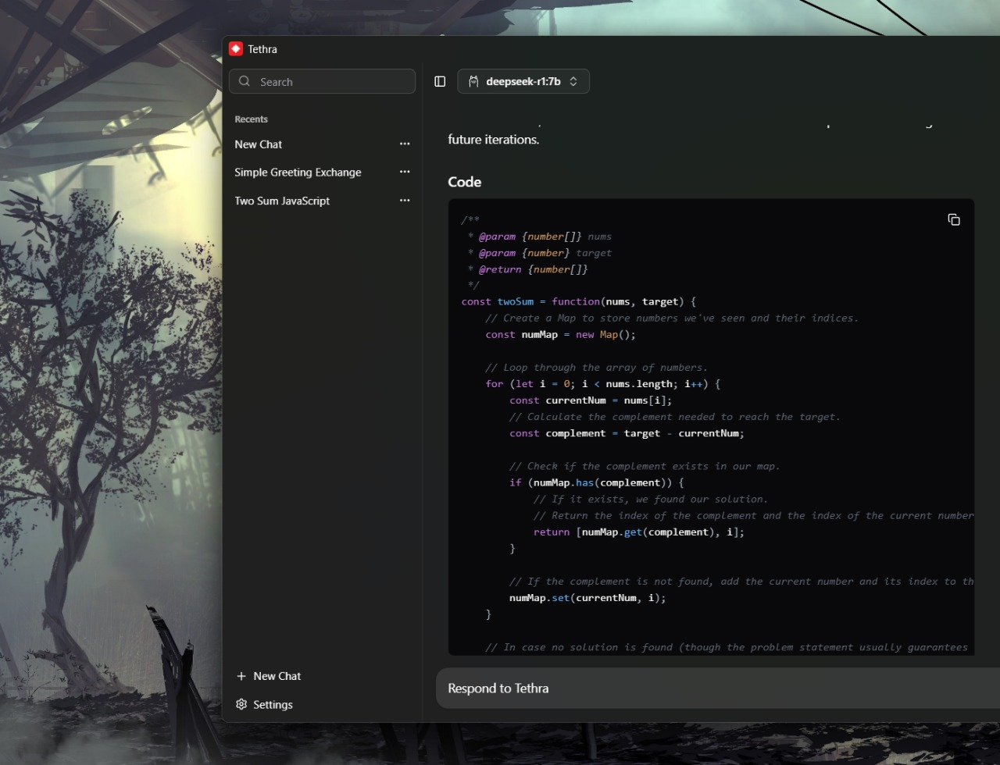

# Tethra - AI Chat Application

A unified AI chat application that lets you use a beautiful local interface while sharing your conversations through the web. Chat locally, share globally.

## Screenshots






##  Tech Stack

### Frontend
- **React 19** - Latest React with concurrent features
- **TypeScript** - Full type safety
- **TanStack Router** - File-based routing
- **Tailwind CSS** - Utility-first styling
- **Shadcn/ui** - High-quality components

### Backend
- **Tauri** - Cross-platform desktop framework
- **Rust** - High-performance backend
- **SQLite** - Local conversation storage
- **WebSocket** - Real-time streaming

### AI Integration
- **Vercel AI SDK** - Unified AI provider interface
- **Streaming Support** - Real-time AI responses
- **Multi-Provider** - OpenAI, Anthropic, Google, and more

##  Getting Started

### Prerequisites
- Node.js 18+ 
- Rust (for Tauri development)
- Git

### Installation

1. **Clone the repository**
```bash
git clone <repository-url>
cd tethra-next
```

2. **Install dependencies**
```bash
npm install
```

3. **Set up environment variables**
```bash
cp .env.example .env
# Add your API keys for OpenAI, Anthropic, Google, etc.
```

4. **Run in development mode**
```bash
npm run dev
```

### Building for Production

```bash
# Build the application
npm run build

# Build for specific platform
npm run tauri build
```

## 🔧 Configuration

### API Keys
Add your AI provider API keys to the `.env` file:

```env
OPENAI_API_KEY=your_openai_key
ANTHROPIC_API_KEY=your_anthropic_key
GOOGLE_API_KEY=your_google_key
```

### Settings
Access settings via `Ctrl+,` or the settings menu:
- **Providers**: Configure AI model access
- **Appearance**: Customize theme and layout
- **General**: Application preferences
- **Sharing**: Configure web sharing options

##  Project Structure

```
src/
├── components/          # React components
│   ├── chat/           # Chat interface components
│   ├── ui/             # Reusable UI components
│   └── icons/          # AI provider icons
├── lib/                # Utility functions
│   ├── chat.ts         # Chat API functions
│   └── chat-cache.ts   # Local caching system
├── routes/             # TanStack Router pages
│   └── shared/         # Web sharing routes
├── hooks/              # Custom React hooks
└── styles/             # Global styles and themes
```

##  Web Sharing Architecture

### Local App
- **Desktop interface** for creating and managing chats
- **Local storage** for conversations and settings
- **AI integration** for real-time responses
- **Share link generation** for any conversation

### Web Interface
- **Public viewing** of shared conversations
- **Read-only access** to chat content
- **Responsive design** for any device
- **No authentication required** for viewing

### Sync Mechanism
- **Real-time updates** when local changes are made
- **WebSocket connection** for live synchronization
- **Optimistic updates** for smooth user experience

##  Contributing

1. Fork the repository
2. Create a feature branch (`git checkout -b feature/amazing-feature`)
3. Commit your changes (`git commit -m 'Add amazing feature'`)
4. Push to the branch (`git push origin feature/amazing-feature`)
5. Open a Pull Request

##  License

This project is licensed under the MIT License - see the [LICENSE](LICENSE) file for details.

##  Acknowledgments

- **TanStack** - Excellent routing and state management
- **Shadcn/ui** - Beautiful component library
- **Tauri** - Cross-platform desktop framework
- **Vercel AI SDK** - Unified AI integration

---

**Tethra** - Chat locally, share globally. 🌐
